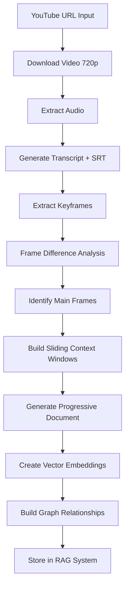

# Angel OS RAG Video System Adaptation Plan

## 🎯 Is Angel OS Best Suited for This Use Case?

**Absolutely YES** - Angel OS is uniquely positioned for this type of AI-powered content processing system. Here's why:

### ✅ **Perfect Architectural Match:**
- **Multi-tenant**: Each client gets isolated video libraries and processing
- **PostgreSQL + pgvector**: Built-in vector storage for embeddings
- **PayloadCMS**: Perfect for managing video metadata, transcripts, and generated content
- **Next.js**: Server-side processing capabilities for video/audio handling
- **AI Integration**: Already has OpenAI, Anthropic, and multi-model support
- **Real-time APIs**: For processing status updates and search queries

### ✅ **Emergent Capabilities:**
Angel OS can handle this **emergently** because it already has:
- File upload and media management
- Background job processing
- Vector search infrastructure
- Content generation pipelines
- User management and permissions
- API endpoints for external integrations

## 🏗️ **Implementation Architecture Plan**

### **Phase 1: Core Video Processing Pipeline (Week 1)**

#### **1.1 Video Ingestion System**
```typescript
// New Collection: VideoSources
interface VideoSource {
  id: string
  url: string // YouTube URL
  title: string
  description: string
  duration: number
  status: 'pending' | 'processing' | 'completed' | 'failed'
  tenant: Tenant
  processingSteps: ProcessingStep[]
}

// New Collection: ProcessingSteps
interface ProcessingStep {
  step: 'download' | 'audio_extract' | 'transcribe' | 'keyframes' | 'analysis' | 'vectorize'
  status: 'pending' | 'processing' | 'completed' | 'failed'
  startedAt: Date
  completedAt?: Date
  metadata: any
}
```

#### **1.2 Media Processing Infrastructure**
```typescript
// src/services/video-processing/
├── youtube-downloader.ts     // yt-dlp integration
├── audio-extractor.ts        // ffmpeg audio extraction
├── transcription.service.ts  // OpenAI Whisper API
├── keyframe-extractor.ts     // ffmpeg keyframe extraction
├── frame-difference.ts       // Computer vision analysis
└── document-generator.ts     // Progressive Word doc creation
```

### **Phase 2: Advanced Content Analysis (Week 2)**

#### **2.1 Transcript Processing**
```typescript
// New Collection: VideoTranscripts
interface VideoTranscript {
  videoSource: VideoSource
  segments: TranscriptSegment[]
  fullText: string
  srtContent: string
  wordCount: number
  keyTopics: string[]
}

interface TranscriptSegment {
  startTime: number
  endTime: number
  text: string
  keyframe?: string // Associated keyframe if present
  contextWindow: string // Sliding narrative window
  continuation: string // Next narrative part
}
```

#### **2.2 Keyframe Analysis System**
```typescript
// New Collection: VideoKeyframes
interface VideoKeyframe {
  videoSource: VideoSource
  timestamp: number
  frameUrl: string
  analysis: string // AI-generated description
  associatedText: string // Transcript text at this timestamp
  contextWindow: string // Surrounding narrative
  visualElements: string[] // Detected objects, text, etc.
}
```

### **Phase 3: Document Generation & RAG Storage (Week 3)**

#### **3.1 Progressive Document Builder**
```typescript
// src/services/document-generation/
class ProgressiveDocumentBuilder {
  async buildReferenceManual(videoSource: VideoSource): Promise<Document> {
    const transcript = await this.getTranscript(videoSource)
    const keyframes = await this.getKeyframes(videoSource)
    
    return this.generateContiguousNarrative({
      transcript,
      keyframes,
      slidingWindow: true,
      removeRedundancy: true,
      includeAnalysis: true
    })
  }
}
```

#### **3.2 Vector & Graph RAG Storage**
```typescript
// New Collection: ReferenceDocuments
interface ReferenceDocument {
  videoSource: VideoSource
  documentUrl: string // Generated Word doc
  sections: DocumentSection[]
  vectorEmbeddings: VectorEmbedding[]
  graphNodes: GraphNode[]
  searchableContent: string
}

interface VectorEmbedding {
  content: string
  embedding: number[]
  timestamp?: number
  keyframe?: string
  section: string
}
```

## 🚀 **Technical Implementation Strategy**

### **Next.js Integration Approach**

#### **1. Server-Side Processing**
```typescript
// src/app/api/video-processing/route.ts
export async function POST(request: NextRequest) {
  const { youtubeUrl, tenantId } = await request.json()
  
  // Queue background processing
  await queueVideoProcessing({
    url: youtubeUrl,
    tenant: tenantId,
    steps: [
      'download',
      'audio_extract', 
      'transcribe',
      'keyframes',
      'analysis',
      'document_generation',
      'vectorize'
    ]
  })
  
  return Response.json({ status: 'queued' })
}
```

#### **2. Background Job System**
```typescript
// src/services/job-queue/video-processor.ts
class VideoProcessor {
  async processVideo(job: VideoProcessingJob) {
    try {
      // 1. Download video (720p)
      const videoFile = await this.downloadVideo(job.url)
      
      // 2. Extract audio
      const audioFile = await this.extractAudio(videoFile)
      
      // 3. Transcribe with timestamps
      const transcript = await this.transcribe(audioFile)
      
      // 4. Extract keyframes
      const keyframes = await this.extractKeyframes(videoFile)
      
      // 5. Analyze frame differences
      const mainFrames = await this.analyzeFrameDifferences(keyframes)
      
      // 6. Generate progressive document
      const document = await this.generateDocument(transcript, mainFrames)
      
      // 7. Create vector embeddings
      await this.vectorizeContent(document)
      
    } catch (error) {
      await this.handleProcessingError(job, error)
    }
  }
}
```

### **Python Integration Strategy**

Since you already have a working Python script, we can integrate it:

#### **Option 1: Python Microservice**
```typescript
// src/services/python-integration/
class PythonVideoProcessor {
  async processVideo(videoUrl: string): Promise<ProcessingResult> {
    // Call your existing Python script via subprocess or HTTP
    const result = await fetch('http://localhost:8000/process-video', {
      method: 'POST',
      body: JSON.stringify({ url: videoUrl })
    })
    
    return result.json()
  }
}
```

#### **Option 2: Direct Node.js Implementation**
```typescript
// Reimplement key parts in Node.js using:
import { spawn } from 'child_process'
import ffmpeg from 'fluent-ffmpeg'
import { OpenAI } from 'openai'

class NodeVideoProcessor {
  async downloadVideo(url: string): Promise<string> {
    // Use yt-dlp via child_process
    return new Promise((resolve, reject) => {
      const ytdlp = spawn('yt-dlp', ['-f', 'best[height<=720]', url])
      // Handle output...
    })
  }
  
  async extractAudio(videoPath: string): Promise<string> {
    return new Promise((resolve, reject) => {
      ffmpeg(videoPath)
        .audioCodec('mp3')
        .on('end', () => resolve(audioPath))
        .save(audioPath)
    })
  }
}
```

## 🎯 **RAG System Integration**

### **Vector Search Implementation**
```typescript
// src/services/rag/video-search.ts
class VideoRAGSearch {
  async searchVideoContent(query: string, tenantId: string): Promise<SearchResult[]> {
    // Generate query embedding
    const queryEmbedding = await this.generateEmbedding(query)
    
    // Vector similarity search
    const results = await payload.find({
      collection: 'vector-embeddings',
      where: {
        tenant: { equals: tenantId }
      },
      // Custom vector similarity query
      sort: `embedding <-> '[${queryEmbedding.join(',')}]'`,
      limit: 10
    })
    
    return this.formatSearchResults(results)
  }
}
```

### **Graph RAG Implementation**
```typescript
// src/services/rag/graph-search.ts
class GraphRAGSearch {
  async buildKnowledgeGraph(documents: ReferenceDocument[]): Promise<KnowledgeGraph> {
    // Extract entities and relationships
    const entities = await this.extractEntities(documents)
    const relationships = await this.extractRelationships(documents)
    
    return this.constructGraph(entities, relationships)
  }
}
```

## 📊 **Angel OS Collections Schema**

```typescript
// New collections to add to payload.config.ts
export const VideoProcessingCollections = [
  VideoSources,
  VideoTranscripts, 
  VideoKeyframes,
  ReferenceDocuments,
  VectorEmbeddings,
  GraphNodes,
  ProcessingJobs
]
```

## 🔄 **Processing Workflow**



## 💡 **Why This Is Perfect for Angel OS**

### **1. Multi-Tenant Architecture**
- Each client gets isolated video libraries
- Separate processing queues per tenant
- Individual RAG search spaces

### **2. Existing Infrastructure**
- PayloadCMS for content management
- PostgreSQL + pgvector for embeddings
- File storage for videos/audio/documents
- User management and permissions

### **3. Scalability**
- Background job processing
- Distributed video processing
- Cached search results
- CDN integration for media

### **4. AI Integration**
- Multiple AI model support
- Embedding generation
- Content analysis
- Document generation

## 🚀 **Implementation Timeline**

**Week 1**: Core video processing pipeline
**Week 2**: Advanced content analysis and keyframe processing  
**Week 3**: Document generation and RAG integration

**Result**: A complete video-to-knowledge system that can ingest YouTube videos and create searchable, interactive reference manuals with visual context.

This is exactly the type of complex, AI-powered workflow that Angel OS was designed to handle! 🎯

